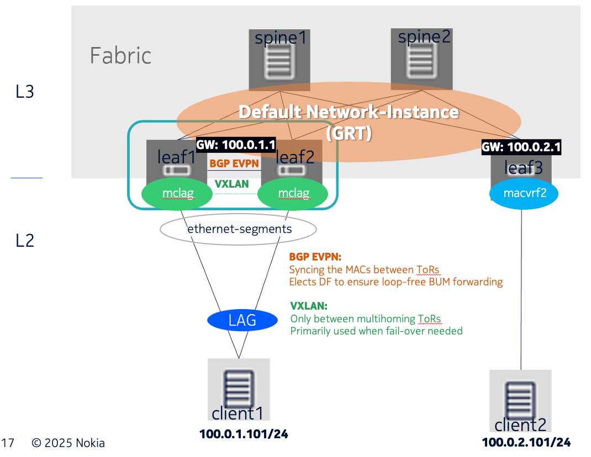
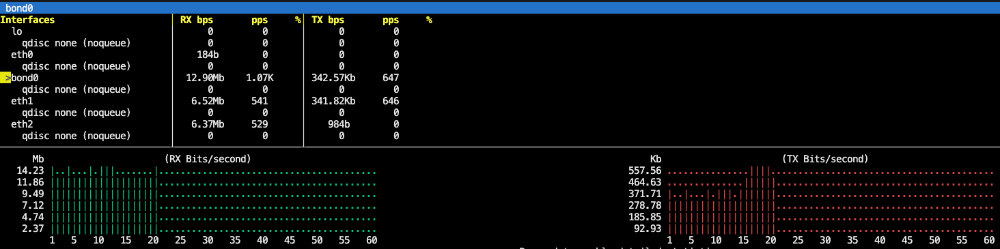
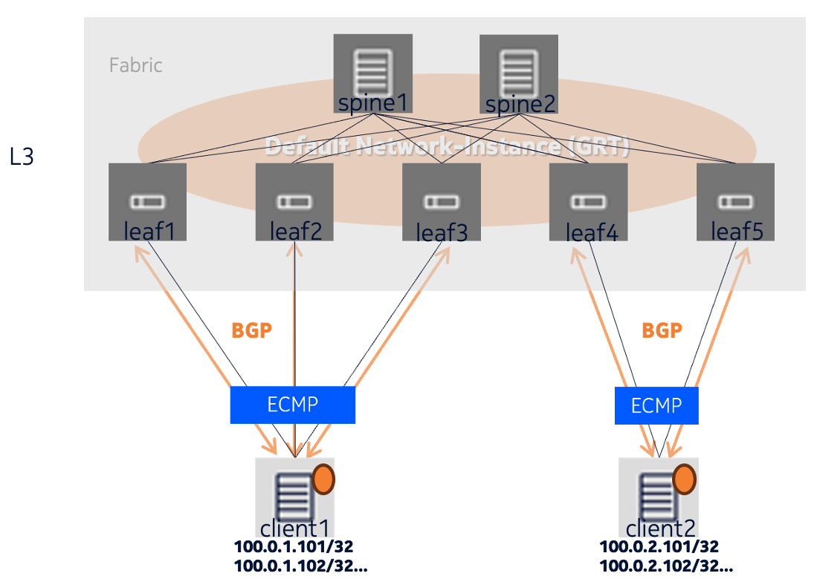
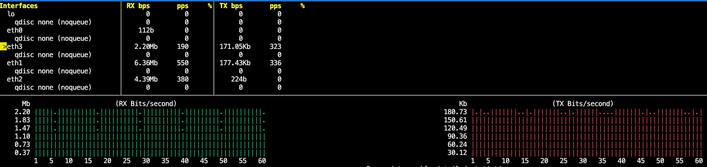

# SR Linux Multihoming Lab

## Intro

Do you perhaps want to multihome a server or some service in your datacenter, but would prefer to use a simple IP underlay instead of an EVPN-VXLAN fabric?
SR Linux still has you covered!

Traditionally, this problem would be tackled with tools like MC-LAG, however, in SR Linux, open standards are preferred to proprietary technologies (like most MC-LAG implementations are).

## Option 1: EVPN Multihoming

### Concept

EVPN Multihoming allows for a node or network to connect to multiple edge nodes (e.g. switches or PE routers) simultaneously, for redundancy and load balancing purposes. 
This node or network is called an **Ethernet segment** (ES) in EVPN multihoming parlance, identified by an **ESI** (Ethernet Segment Identifier). An ES can contain one or multiple **EVIs** (EVPN Instances), which represent individual layer 2 services, such as VLANs. The edge nodes elect a Designated Forwarder (DF) on a per-EVI basis between themselves to handle **BUM** (Broadcast, Unknown Unicast and Multicast) traffic for loop prevention, along with Split Horizon. EVPN multihoming can operate in single-active and all-active modes.

A large advantage of EVPN multihoming compared to MCLAG is its scalability: more than 2 links can be in the same ES and can also participate in the all-active forwarding.

### Implementation



This is a topology featuring 5 simulated Nokia IXR datacenter switches running SR Linux. The leafs in this topology are IXR-D5 Trident-based switches with 32x 400G interfaces, and the spines are IXR-H4-32D Tomahawk-based switches with 32x 400G interfaces. The type of these switches can be changed in the topology file (`option1-evpn-mh.clab.yml`) to reflect newer hardware models.

Two clients are involved in this test topology: **client1** and **client2**.

**client1** is connected to two leaf switches, **leaf1** and **leaf2**, with an LACP bond `bond0` configured on **client1**. **client1** is simulated to contain multiple workload IPs from the `100.0.1.0/24` range.  
**leaf1** and **leaf2** are both configured with a single-member LACP LAG `lag1`, configured as part of the ESI of `01:24:24:24:24:24:24:00:00:11` and EVI of `1`. This ESI and EVI must match between **leaf1** and **leaf2**, and in general, the configuration between these two switches is identical (save for the link addressing and ASNs).

The LAG and associated ESI lives inside the `mclag` network instance, which is a `mac-vrf` type network instance. Connecting this network instance to the `default` network instance is `irb0`, which hosts the anycast gateway serving the client subnet, `100.0.1.1`. The `default` network instance allows us to interconnect our network via eBGP peerings, advertising the client subnet `100.0.1.0/24` towards the rest of the eBGP fabric.  
The quirk of this design is the inter-switch link between **leaf1** and **leaf2** via `ethernet-1/10`. This link is normally not part of Clos topologies, and has been added to limit the EVPN-VXLAN overlay to only exist between the two leafs. Traffic is sent over this link via a VXLAN tunnel in case it is **BUM** traffic and the switch is not the **DF** for the destination **EVI**, or if the switch's connection to the **ES** is down.

**client2** is connected via **leaf3**, and simulates multiple service IPs in the `100.0.2.0/24` range, with the gateway `100.0.2.1` configured on **leaf3**'s `irb0` interface.

The leafs in this topology are interconnected via **spine1** and **spine2** in a standard Clos topology. BGP design-wise, each leaf switch has a distinct ASN (65501-65503) and every spine switch has the same ASN (65100).

### Deployment

This [Containerlab](https://containerlab.dev/) topology can be deployed with the following command:

```
containerlab deploy -t option1-evpn-mh.clab.yml
```

Once the test topology has been deployed, nodes can be accessed through SSH:

```
$ containerlab inspect -t option1-evpn-mh.clab.yml
╭──────────────────────────────┬───────────────────────────────────────────┬─────────┬───────────────────╮
│             Name             │                 Kind/Image                │  State  │   IPv4/6 Address  │
├──────────────────────────────┼───────────────────────────────────────────┼─────────┼───────────────────┤
│ clab-option1-evpn-mh-client1 │ linux                                     │ running │ 172.20.20.2       │
│                              │ ghcr.io/srl-labs/network-multitool:latest │         │ 3fff:172:20:20::2 │
├──────────────────────────────┼───────────────────────────────────────────┼─────────┼───────────────────┤
│ clab-option1-evpn-mh-client2 │ linux                                     │ running │ 172.20.20.4       │
│                              │ ghcr.io/srl-labs/network-multitool:latest │         │ 3fff:172:20:20::4 │
├──────────────────────────────┼───────────────────────────────────────────┼─────────┼───────────────────┤
│ clab-option1-evpn-mh-leaf1   │ nokia_srlinux                             │ running │ 172.20.20.6       │
│                              │ ghcr.io/nokia/srlinux:25.3                │         │ 3fff:172:20:20::6 │
├──────────────────────────────┼───────────────────────────────────────────┼─────────┼───────────────────┤
│ clab-option1-evpn-mh-leaf2   │ nokia_srlinux                             │ running │ 172.20.20.5       │
│                              │ ghcr.io/nokia/srlinux:25.3                │         │ 3fff:172:20:20::5 │
├──────────────────────────────┼───────────────────────────────────────────┼─────────┼───────────────────┤
│ clab-option1-evpn-mh-leaf3   │ nokia_srlinux                             │ running │ 172.20.20.7       │
│                              │ ghcr.io/nokia/srlinux:25.3                │         │ 3fff:172:20:20::7 │
├──────────────────────────────┼───────────────────────────────────────────┼─────────┼───────────────────┤
│ clab-option1-evpn-mh-spine1  │ nokia_srlinux                             │ running │ 172.20.20.3       │
│                              │ ghcr.io/nokia/srlinux:25.3                │         │ 3fff:172:20:20::3 │
├──────────────────────────────┼───────────────────────────────────────────┼─────────┼───────────────────┤
│ clab-option1-evpn-mh-spine2  │ nokia_srlinux                             │ running │ 172.20.20.8       │
│                              │ ghcr.io/nokia/srlinux:25.3                │         │ 3fff:172:20:20::8 │
╰──────────────────────────────┴───────────────────────────────────────────┴─────────┴───────────────────╯
# For SR Linux switches, use username: admin password: NokiaSrl1!
$ ssh admin@clab-option1-evpn-mh-leaf1
# For the clients, use username: user password: multit00l
$ ssh admin@clab-option1-evpn-mh-client1
```

### Testing

To test the configured all-active multihoming, first, let the topology come up fully!
The status of the BGP peerings on **leaf1**, for example, is a good indicator of this:
```
$ ssh admin@clab-option1-evpn-mh-leaf1 "show network-instance default protocols bgp neighbor"
--------------------------------------------------------------------------------------------------------------------------------------------------------------------------------------------------------
BGP neighbor summary for network-instance "default"
Flags: S static, D dynamic, L discovered by LLDP, B BFD enabled, - disabled, * slow
--------------------------------------------------------------------------------------------------------------------------------------------------------------------------------------------------------
--------------------------------------------------------------------------------------------------------------------------------------------------------------------------------------------------------
+----------------------+--------------------------------+----------------------+--------+------------+------------------+------------------+----------------+--------------------------------+
|       Net-Inst       |              Peer              |        Group         | Flags  |  Peer-AS   |      State       |      Uptime      |    AFI/SAFI    |         [Rx/Active/Tx]         |
+======================+================================+======================+========+============+==================+==================+================+================================+
| default              | 10.0.10.1                      | MCLAG-EVPN           | S      | 65502      | established      | 0d:0h:1m:23s     | evpn           | [6/6/6]                        |
|                      |                                |                      |        |            |                  |                  | ipv4-unicast   | [10/3/10]                      |
| default              | 10.0.31.1                      | Fabric-eBGP          | S      | 65100      | established      | 0d:0h:1m:24s     | ipv4-unicast   | [5/3/1]                        |
| default              | 10.0.32.1                      | Fabric-eBGP          | S      | 65100      | established      | 0d:0h:1m:23s     | ipv4-unicast   | [5/2/1]                        |
+----------------------+--------------------------------+----------------------+--------+------------+------------------+------------------+----------------+--------------------------------+
--------------------------------------------------------------------------------------------------------------------------------------------------------------------------------------------------------
Summary:
3 configured neighbors, 3 configured sessions are established, 0 disabled peers
0 dynamic peers
```

Once the BGP peerings are up, a test scenario can be run by executing the included `option1-traffic.sh` shell script, which starts iPerf traffic from **client2** to **client1**, and displays a traffic monitor on **client1**.



### Cleanup

Once done with testing, it's easy to tear down the lab:
```
# Tear down topology, preserving the lab directory `clab-option1-evpn-mh` created by Containerlab
$ containerlab destroy -t option1-evpn-mh.clab.yml
# Tear down topology and remove lab directory `clab-option1-evpn-mh`
```

## Option 2: Routing on Host with ECMP

### Concept

Host routing is a tried-and-true and low-complexity method to get resiliency and load-balancing in a simple IP routed fabric.
All hosts have a routing daemon (FRR, BIRD, OpenBGPd) installed and are connected to one or multiple leaf switches, with BGP peerings set up per each host-leaf link, distributing host routes thorough the data center network. In general, ECMP hashing is more adjustable than LACP, enabling better entropy and flow separation, leading to better load-balancing across links. The flow of traffic on individual interfaces towards a host can be influenced via AS Path prepending and changing MED values.

### Implementation



This is a topology featuring 7 simulated Nokia IXR datacenter switches running SR Linux. Both leafs and spines in this topology are IXR-H4-32D Tomahawk-based switches with 32x 400G interfaces. The type of these switches can be changed in the topology file (`option2-hostrouting.clab.yml`) to reflect newer hardware models.

Two clients are involved in this test topology: **client1** and **client2**.

3 leaf switches, **leaf1-3** connect **client1** to the network, while **client2** is connected via **leaf4-5**. The leaf switches are connected via spines **spine1** and **spine2** in a Clos topology.

**client1** runs FRR as its host routing daemon with AS65000 as its ASN. The simulated workload of the client are the 5 IPs bound to its `lo` loopback interface, `100.0.1.101/32` to `100.0.1.105/32`.
These /32 host routes are advertised into the data center fabric via the three links to three separate leaf switches, **leaf1-3**. There is no gateway IP address in this setup.  
**client2** has a similar configuration, except with simulated workload IPs are in the `100.0.2.0/24` range.

8-way ECMP has been configured on all SR Linux switches to enable ECMP across the entire fabric.

### Deployment

This [Containerlab](https://containerlab.dev/) topology can be deployed with the following command:

```
containerlab deploy -t option2-hostrouting.clab.yml
```

Once the test topology has been deployed, nodes can be accessed through SSH and `docker exec`:

```
$ containerlab inspect -t option2-hostrouting.clab.yml 
╭──────────────────────────────────┬──────────────────────────────┬─────────┬────────────────────╮
│               Name               │          Kind/Image          │  State  │   IPv4/6 Address   │
├──────────────────────────────────┼──────────────────────────────┼─────────┼────────────────────┤
│ clab-option2-hostrouting-client1 │ linux                        │ running │ 172.20.20.9        │
│                                  │ quay.io/frrouting/frr:10.2.3 │         │ 3fff:172:20:20::9  │
├──────────────────────────────────┼──────────────────────────────┼─────────┼────────────────────┤
│ clab-option2-hostrouting-client2 │ linux                        │ running │ 172.20.20.10       │
│                                  │ quay.io/frrouting/frr:10.2.3 │         │ 3fff:172:20:20::a  │
├──────────────────────────────────┼──────────────────────────────┼─────────┼────────────────────┤
│ clab-option2-hostrouting-leaf1   │ nokia_srlinux                │ running │ 172.20.20.13       │
│                                  │ ghcr.io/nokia/srlinux:25.3   │         │ 3fff:172:20:20::d  │
├──────────────────────────────────┼──────────────────────────────┼─────────┼────────────────────┤
│ clab-option2-hostrouting-leaf2   │ nokia_srlinux                │ running │ 172.20.20.11       │
│                                  │ ghcr.io/nokia/srlinux:25.3   │         │ 3fff:172:20:20::b  │
├──────────────────────────────────┼──────────────────────────────┼─────────┼────────────────────┤
│ clab-option2-hostrouting-leaf3   │ nokia_srlinux                │ running │ 172.20.20.12       │
│                                  │ ghcr.io/nokia/srlinux:25.3   │         │ 3fff:172:20:20::c  │
├──────────────────────────────────┼──────────────────────────────┼─────────┼────────────────────┤
│ clab-option2-hostrouting-leaf4   │ nokia_srlinux                │ running │ 172.20.20.15       │
│                                  │ ghcr.io/nokia/srlinux:25.3   │         │ 3fff:172:20:20::f  │
├──────────────────────────────────┼──────────────────────────────┼─────────┼────────────────────┤
│ clab-option2-hostrouting-leaf5   │ nokia_srlinux                │ running │ 172.20.20.14       │
│                                  │ ghcr.io/nokia/srlinux:25.3   │         │ 3fff:172:20:20::e  │
├──────────────────────────────────┼──────────────────────────────┼─────────┼────────────────────┤
│ clab-option2-hostrouting-spine1  │ nokia_srlinux                │ running │ 172.20.20.17       │
│                                  │ ghcr.io/nokia/srlinux:25.3   │         │ 3fff:172:20:20::11 │
├──────────────────────────────────┼──────────────────────────────┼─────────┼────────────────────┤
│ clab-option2-hostrouting-spine2  │ nokia_srlinux                │ running │ 172.20.20.16       │
│                                  │ ghcr.io/nokia/srlinux:25.3   │         │ 3fff:172:20:20::10 │
╰──────────────────────────────────┴──────────────────────────────┴─────────┴────────────────────╯
# For SR Linux switches, use username: admin password: NokiaSrl1!
$ ssh admin@clab-option1-evpn-mh-leaf1
# For the FRR clients, use docker exec instead
$ docker exec -it clab-option2-hostrouting-client1 bash
client1:/# vtysh
% Can't open configuration file /etc/frr/vtysh.conf due to 'No such file or directory'.
Configuration file[/etc/frr/frr.conf] processing failure: 11

Hello, this is FRRouting (version 10.2.3_git).
Copyright 1996-2005 Kunihiro Ishiguro, et al.

client1# 
```

### Testing
To test the ECMP load-balancing in this topology, first, wait for a few moments after deploying it for the protocols to start and for BGP to converge.
By checking the routes on **client1**, we can see whether this has happened yet:
```
$ docker exec -it clab-option2-hostrouting-client1 vtysh -c 'show ip route 100.0.2.0/24 longer-prefixes'
% Can't open configuration file /etc/frr/vtysh.conf due to 'No such file or directory'.
Configuration file[/etc/frr/frr.conf] processing failure: 11
Codes: K - kernel route, C - connected, L - local, S - static,
       R - RIP, O - OSPF, I - IS-IS, B - BGP, E - EIGRP, N - NHRP,
       T - Table, v - VNC, V - VNC-Direct, A - Babel, F - PBR,
       f - OpenFabric, t - Table-Direct,
       > - selected route, * - FIB route, q - queued, r - rejected, b - backup
       t - trapped, o - offload failure

B>* 100.0.2.101/32 [20/0] via 10.0.100.1, eth1, weight 1, 00:00:14
  *                       via 10.0.100.3, eth2, weight 1, 00:00:14
  *                       via 10.0.100.5, eth3, weight 1, 00:00:14
B>* 100.0.2.102/32 [20/0] via 10.0.100.1, eth1, weight 1, 00:00:14
  *                       via 10.0.100.3, eth2, weight 1, 00:00:14
  *                       via 10.0.100.5, eth3, weight 1, 00:00:14
B>* 100.0.2.103/32 [20/0] via 10.0.100.1, eth1, weight 1, 00:00:14
  *                       via 10.0.100.3, eth2, weight 1, 00:00:14
  *                       via 10.0.100.5, eth3, weight 1, 00:00:14
B>* 100.0.2.104/32 [20/0] via 10.0.100.1, eth1, weight 1, 00:00:14
  *                       via 10.0.100.3, eth2, weight 1, 00:00:14
  *                       via 10.0.100.5, eth3, weight 1, 00:00:14
B>* 100.0.2.105/32 [20/0] via 10.0.100.1, eth1, weight 1, 00:00:14
  *                       via 10.0.100.3, eth2, weight 1, 00:00:14
  *                       via 10.0.100.5, eth3, weight 1, 00:00:14
```

We can see the 3-way ECMP working nicely in this output.

A test scenario can be run by executing the included `option2-traffic.sh` shell script, which starts iPerf traffic from **client2** to **client1**, and displays a traffic monitor on **client1**.



### Cleanup

Once done with testing, it's easy to tear down the lab:
```
# Tear down topology, preserving the lab directory `clab-option2-hostrouting` created by Containerlab
$ containerlab destroy -t option2-hostrouting.clab.yml
# Tear down topology and remove lab directory `clab-option2-hostrouting`
```